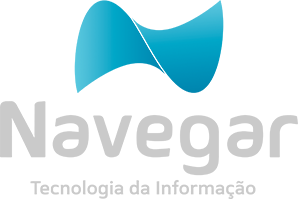

  # Inovação e Tecnologia

    ---

    # Metas
    .left-column[
    * Seções de trocas de conhecimento e estudos
    * Eventos assistidos
    * Tecnologias novas implementadas
    ]
    .right-column.imagem[]

    ---

    # Seções de trocas de conhecimento e estudos
    .left-column[
    * Fonte de dados será o TeamWork
    * Meta de acordo com numero de colabores (12) (0,5h/mês cada)
    * Meta Atingida com total de 6 horas gastas.
    ]

    ---

    # Eventos assistidos
    * Fonte de dados serão inscrições nos eventos.
    * Meta de acordo com numero de colabores (12) (2 Inscrições/mês)
    * Meta atingida com 2 Inscrições.

    ---

    # Tecnologias novas implementadas
    * Fonte de dados documentação basica dos projetos.
    * Meta de acordo com numero de projetos (2 Novas tecnologias/mês)
    * Meta atingida com 2 novas implementações.

    ---

    # Indicador Tecnologia e inovação
    ### Escala:

    Pontuação  | Descrição
    :---------- |:----------
    0  | Sem evolução
    1  | Ruim
    2  | Bom
    3  | Muito Bom

    ---

    class: center, middle

    # Resultados Outubro/2016
    #### https://docs.google.com/spreadsheets/d/1OsXF2oWy7n009XrI-U2PoRloPtoh-Y6xcbycF0XjSk8/edit?usp=sharing
